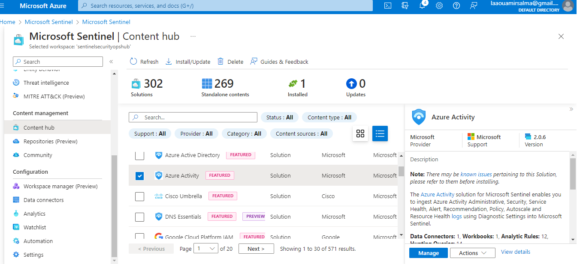
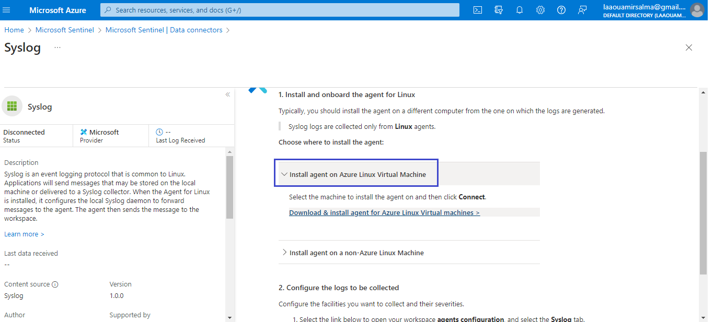
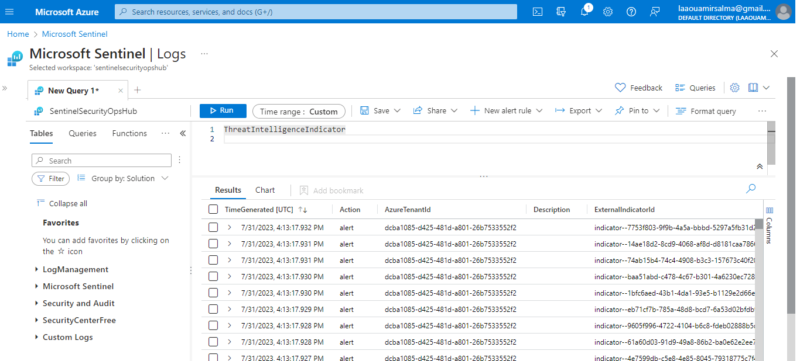

## Let's know how to set Data Connectors

Once your subscription, authorization, resource group, and workspace are set up, the next step is to activate the data connectors. Here is a list of available connectors and their configuration:

### List of Connectors

1. **Azure Active Directory**
   - Connects and integrates logs from Azure Active Directory for identity and access management.

2. **Azure Activity Log**
   - Ingests activity logs from your Azure subscription to monitor platform-level actions.

3. **Microsoft Defender for Cloud**
   - Collects security data and alerts from Microsoft Defender for Cloud.

4. **Microsoft Defender for Identity**
   - Integrates security alerts and events from Microsoft Defender for Identity.

5. **Microsoft Defender for Office 365**
   - Connects data from Microsoft Defender for Office 365 for email and file protection.

6. **Syslog**
   - Allows integration of log data via Syslog protocol from Linux machines.

7. **TAXII Server**
   - Connects threat intelligence feeds via the TAXII protocol.

8. **Windows Security Events via AMA**
   - Collects Windows security events via Azure Monitor Agent (AMA).

  

    
  

  Before connecting any connector the workspae still empty:

   

    
  

### Installing Connectors, examples of Syslog and TAXII connectors:

1. **Access the Content Hub**
   - Install connectors from the “Content Hub” to ingest data, monitor, and alert.

   

    
  

2. **Configure the Syslog Connector**
   - Install the Linux agent on an Azure virtual machine.

   

    
  

  
   - Select the types of data you want to receive.

   

    
  

   - Choose the type of data you want to collect.

   

    
  

3. **Configure the TAXII Connector**
   - Provide the API root URI and collection ID for TAXII 2.0 or 2.1.

   

    
  

  
   - Use threat data from sources like AlienVault OTX.

   

    
  

   - Here is the indicatore collected
   

    
  

   

    
  

