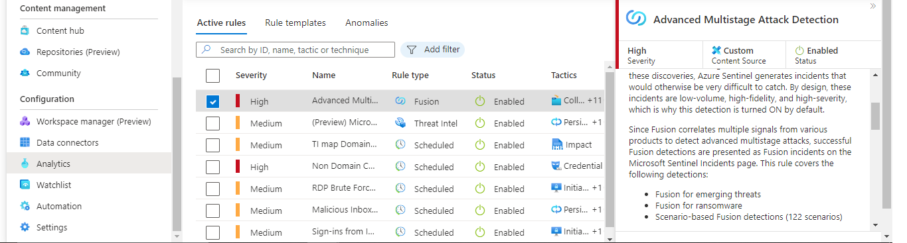
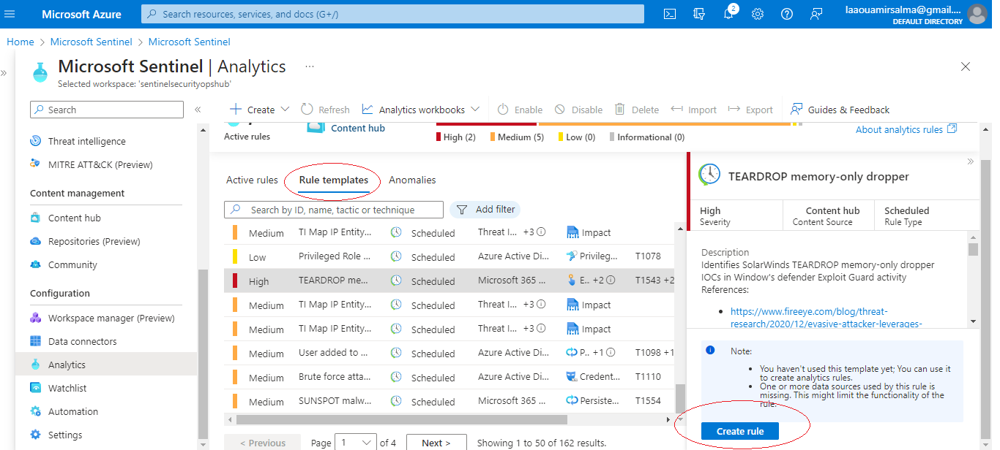
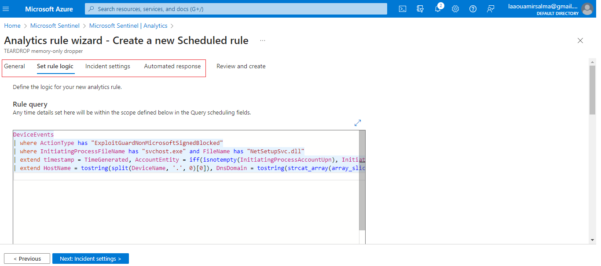
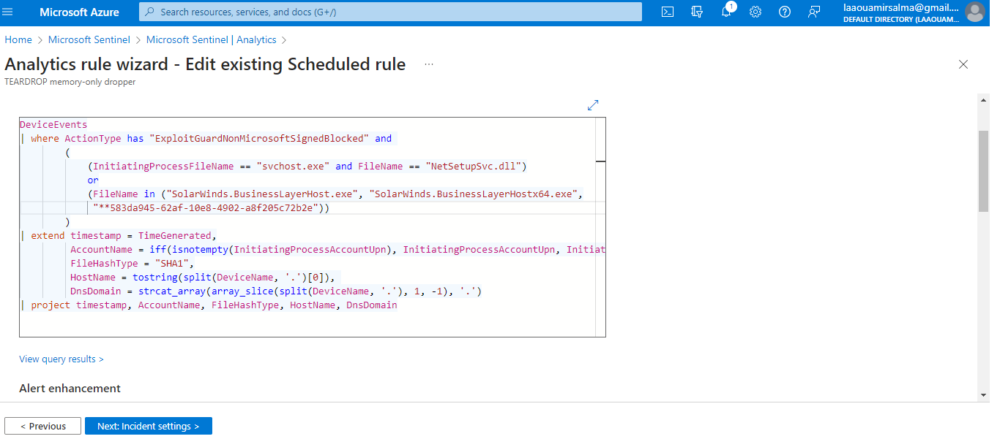

## Threat Detection and Analysis

### Overview

Threat detection in Microsoft Sentinel involves enabling built-in analytics rules and creating custom rules using Kusto Query Language (KQL). These rules help identify specific events or sets of events in your environment. When the conditions specified in the rules are met, alerts or incidents are generated and can be automatically responded to.

### Advanced Multi-Stage Attack Detection

Microsoft Sentinel utilizes **Fusion**, a machine learning-based correlation engine, to automatically detect multi-stage attacks (also known as Advanced Persistent Threats or APTs). Fusion identifies combinations of abnormal behaviors and suspicious activities across different stages of the attack chain. This method reduces false positives and enhances detection of emerging threats with high fidelity and severity.

#### Fusion Technology

- **Automatic Detection**: Fusion detects multi-stage attacks by correlating abnormal behaviors and activities.
- **Reduced False Positives**: It minimizes false alerts by focusing on high-severity incidents.
- **Default Activation**: Fusion is enabled by default in Microsoft Sentinel under the "Advanced Multistage Attack Detection" rule.

  

    
  

  

    
  

### Scheduled Analytics Rules

Analytics rules search for specific events and trigger incidents when certain thresholds or conditions are met. These incidents are then reviewed and responded to by the Security Operations Center (SOC).

#### Modifying and Activating Scheduled Rules

- **Access Rules**: Navigate to "Analytics" in Microsoft Sentinel to view details of active rules, anomalies, and templates.
- **KQL Queries**: Analytics rules are based on KQL queries. You can view and modify these queries as needed.
- **Creating and Editing Rules**: Select "Create Rule" to start the creation wizard, where you can adjust the logic and settings of the rule.

  

    
  

#### Example: Custom Rule Creation

- **Rule Example**: "TEARDROP memory-only dropper" identifies indicators of compromise in Windows Defender’s Exploit Guard.
- **Query Enhancements**: Updated queries focus on specific indicators and exclude lower severity alerts.

Old Query for TEARDROP 

  

    
  

Updated Query for TEARDROP

  

    
  

- **Creating Custom Rules**: Use "+Create" on the analytics rules page and select "Scheduled query rule" to define custom detection criteria.

  

    
  

### Creating and Configuring Advanced Analytics Rules

To create a custom rule:
1. **Define Rule Details**: Name, description, severity, and attack categories based on MITRE ATT&CK.
2. **Set KQL Query**: Example: Detecting RDP attacks using specific Event IDs and status codes.

  

    
  

  

    
  

  

    
  

  

    
  

- **Query Expansion**: Extend queries to include additional fields and map entities to enrich results.

For optimal results, tailor your rules to focus on high-impact alerts and continuously refine based on evolving threats and data.
