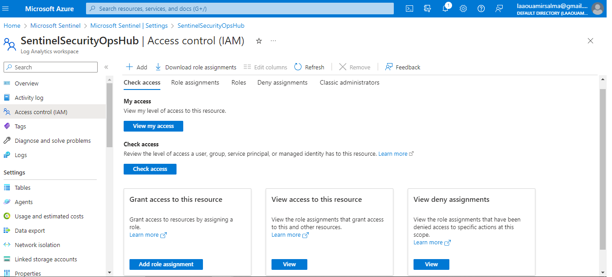

# How to start: Step-by-Step Guide

## Creating a Log Analytics Workspace and Activating Azure Sentinel

To deploy Azure Sentinel, it's recommended to create a dedicated Log Analytics workspace rather than using an existing one. Here’s a simplified guide to get started:

### **Step 1: Set Up Your Azure Environment**
- **Choose an Active Azure Subscription:** Make sure you have an active Azure subscription.
- **Create or Select a Resource Group:** Organize and manage resources associated with the project by selecting or creating a resource group.

### **Step 2: Create a Log Analytics Workspace**
- Follow the guided steps to create a Log Analytics workspace in Azure.
  
  

    
  

### **Step 3: Add Microsoft Sentinel**
- Navigate to the Azure Portal and search for "Microsoft Sentinel" in the search bar.
- Select Microsoft Sentinel and follow the prompts to configure the necessary settings. This includes linking the Log Analytics workspace to Microsoft Sentinel.

  

    
  

### **Step 4: Configure Advanced Settings**
Once Azure Sentinel is added to your Log Analytics workspace, you can configure its advanced settings. Key aspects to consider include:

#### **Environment Settings**
- Managed within Azure Sentinel and the Log Analytics workspace.
- Access "Settings" from the left navigation pane in Azure Sentinel.

  

    
  

#### **Cost Optimization and Data Retention**
- **Daily Cap:** Set a daily ingestion limit to control the volume of data entering the Log Analytics workspace, which helps manage costs.

  

    
  

- **Data Retention:** Adjust the data retention period from 30 to 2555 days based on legal, regulatory, and operational needs. Keep in mind that longer retention periods can lead to higher storage costs.

  

    
  

### **Step 5: Manage Access with IAM**
- Use the IAM (Identity and Access Management) page to assign roles and manage access to Azure resources, ensuring rigorous security in the Azure environment.

  

    
  

