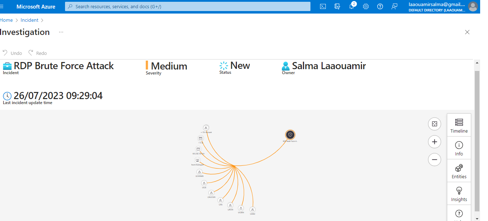
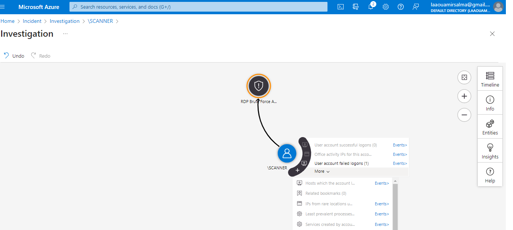

## 3.3.2 Investigation

Once data sources are connected to Microsoft Sentinel, the investigation process begins when an alert is generated. Here’s a detailed guide on how to manage and investigate incidents:

### Incident Creation and Management

- **Creating Incidents:** Azure Sentinel allows the creation of advanced analytics rules to generate incidents based on detected alerts. An incident aggregates multiple alerts, providing a consolidated view of relevant evidence for a specific investigation.
  - **Example:** The "RDP Brute Force Attack" incident was generated by an analytics rule applied to an Azure virtual machine.
 
      

    
      

### Accessing and Analyzing Incidents

- **Incident Page:** Navigate to the **Incidents** section to view the number of new, active, or closed incidents. Each incident displays the time of occurrence, its status, and severity to help prioritize investigation efforts.

  

    
  

 
- **Using Workbooks:** Workbooks can be used to visualize and filter incidents according to investigation needs.

 

    
  

### Contextual Analysis

- **Incident Context:** Incidents contain crucial contextual information, including associated entities discovered through analytics rule logic (KQL). These entities are vital for understanding the scope and identifying the root cause of threats.

 

    
  

### Exploration and Investigation

- **Investigation Graph:** Use the investigation graph to correlate data and explore involved entities. You can drill down into any entity to obtain additional details.
  - Example: For instance, selecting the IP address "103.238.110.134" in the investigation graph reveals details such as suspicious RDP login attempts.

### External Tools

- **IP Lookup:** Utilize external tools like **AbuseIPDB** to gather further information on suspicious IP addresses.

 

    
  

### Threat Geolocation

- **PowerShell Script:** A custom PowerShell script can extract geographical metadata from Windows event logs. This data can be sent to a third-party API to obtain geolocation information.
 

    
  

- **Log Ingestion:** Custom logs containing geospatial information are ingested and mapped in Azure Sentinel, with custom fields in Log Analytics for effective visualization.
 

    
  

   

    
  

