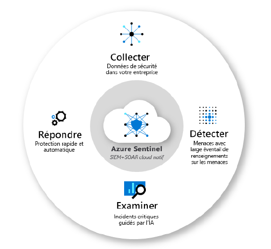

# Azure Sentinel Deployment Tutorial
## Description
This project explores and implements Azure Sentinel, a cloud-based security event management tool. The primary goal is to show you how to deploy Azure Sentinel in a corporate environment and assess its effectiveness in enhancing threat detection and incident response.

The project begins with an introduction to Azure Sentinel and its cybersecurity-oriented features. It then elaborates on the methodology, including configuring data sources, creating advanced analysis rules, integrating threat intelligence, and automating incident responses using playbooks. Finally, the tutorial covers threat hunting, showcasing how customized queries can detect previously unidentified threats.

## Languages and Utilities Used
- **Azure**
- **PowerShell**
- **KQL (Kusto Query Language)**
- **Microsoft Sentinel API**

## What is Azure Sentinel?
Azure Sentinel is a scalable, cloud-native solution that provides intelligent security analytics and threat intelligence across the enterprise. It offers advanced security event and information management (SIEM) capabilities to enable proactive threat hunting, streamlined incident response, and comprehensive threat intelligence integration.

## Project Walk-through
### 1. Why using Azure Sentinel
Security Operations (SecOps) are a critical sub-discipline within the information security industry. They act as the central hub for identifying and responding to cybersecurity threats, from initial alert triage to escalation handling, malware analysis, threat intelligence, and threat hunting.

However, many SecOps rely on on-premises infrastructure, which limits scalability and the ability to allocate resources for advanced machine learning algorithms. This limitation presents several challenges in today's rapidly evolving threat landscape:

- **Data Collection from Multiple Sources:** The growing tsunami of data complicates security operations. Organizations generate massive amounts of digital information, and analyzing and correlating security events from various sources can overwhelm security teams, potentially causing them to miss critical indicators of compromise buried in the noise.
  
- **Complex Threat Intelligence Integration:** Integrating threat intelligence effectively into traditional security operations can be complex. Threat intelligence must be used to enrich threat detection and response, but this integration is challenging due to the diversity of threat intelligence sources.
  
- **Threat Hunting Challenges:** Traditional security centers were not originally designed with automation in mind. They often lack the computational power and flexibility required for machine learning-based threat hunting, resulting in analysts being bogged down by manual, tedious tasks when identifying emerging threats.
  
- **Alert Management:** The surge in alerts exacerbates the problem. As threat detection capabilities improve, the number of generated alerts increases significantly, making it difficult to distinguish genuine threats from false positives in the flood of notifications. This strains already overtaxed resources and increases the risk of missing real threats.

  

### 2. Scope and Objectives
To address these challenges, many companies turn to advanced threat management solutions like Azure Sentinel. However, the effectiveness of these solutions heavily depends on their implementation and adaptation to the specific needs of each organization. The central objective of this study is to explore Azure Sentinel in depth, with a focus on deploying it within existing corporate environments. We aim to assess the utility of Azure Sentinel in enhancing threat detection and incident response while addressing the challenges related to platform management, threat intelligence integration, and multi-source data collection.

## Repository Structure
- 'README.md' : Overview and general information about the project.
- 'connecting-collectors.md' : Steps and screenshots on connecting data sources to Azure Sentinel.
- 'setting-rules.md' : Guide on setting up and customizing alert rules within Sentinel.
- 'incident-management.md' : Explanation of incident management processes, including escalations and playbooks.
- 'dashboards-and-visualizations.md' : Details on setting up dashboards and visualizations for monitoring and analysis.
  
