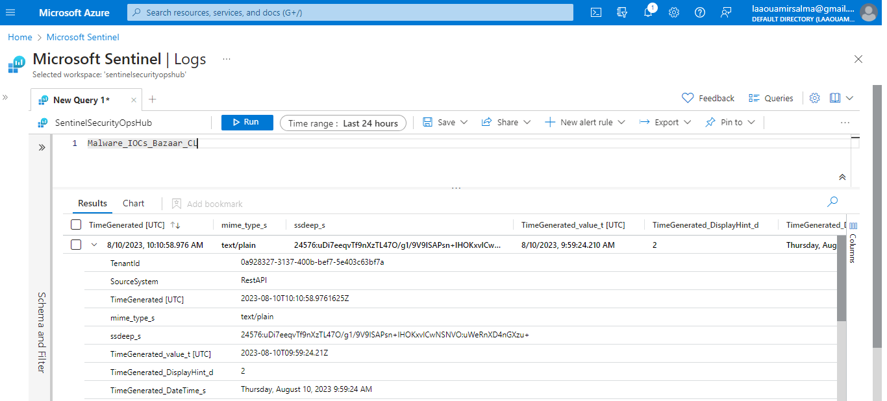

## 3.3.4 Threat Hunting

### Threat Hunting in Azure Sentinel

Threat hunting is a proactive approach aimed at discovering previously undetected cases, involving active exploration of data to identify unusual behaviors and patterns that may indicate ongoing or imminent malicious activities. This approach differs from incident response, which reacts to events that have already occurred, whereas threat hunting aims to prevent incidents from happening. It represents an advanced step in protecting an organization against cyber threats.

Microsoft Sentinel offers powerful search and query tools for threat hunting across organizational data sources. The hunting dashboard provides ready-to-use query examples to help get started. You can also create custom hunting queries and run them live against data stored in Azure Data Explorer. The hunting dashboard allows you to execute all your queries or a selected subset with a single action. Access the dashboard by selecting **Hunting** in the Microsoft Sentinel portal.
 
  

    
  

### Query Examples

- **Hunting Dashboard:** The dashboard lists queries written by Microsoft's security analysts as well as any additional queries you have created or modified. Each query provides a description of what it searches for and the types of data it operates on. Queries are grouped by MITRE ATT&CK tactics, with icons categorizing the type of threat, such as initial access, persistence, and exfiltration. MITRE ATT&CK techniques are listed in the Techniques column, describing specific behaviors identified by the hunting query.

### Example Query: Least Common Parent And Child Process Pairs

- **Objective:** This query examines less common parent-child process combinations within the selected environment (e.g., the virtual machine 'windows-vm-honypot') to detect potentially disguised malicious activities.

  

    
  

  
  - **Query Details:** The query analyzes data in the 'SecurityEvent' table, defining time variables and a list of allowed process names. It filters events with 'EventID' 4688 (process creation event) and non-empty 'ParentProcessName', grouping processes into parent-child pairs. Results include occurrences, involved computers, and associated users to identify pairs with occurrences below a predefined sensitivity threshold.
  

### Threat Hunting Using Threat Intelligence

Cyber Threat Intelligence (CTI) plays a crucial role in proactively protecting the organization from cyber threats. It provides essential information on current attack trends, indicators of compromise (IoCs), tactics, techniques, and procedures (TTPs) used by adversaries, and practical defense strategies. Integrating CTI with threat hunting allows the organization to stay ahead of security threats and better anticipate and respond to cyber threats.

- **CTI Collection:** Reputable and open-source sources offer continuous threat intelligence, including CTI databases, threat sharing centers (ISAC/ISAO), and other trusted sources like Abuse.ch. Their MalwareBazaar project shares malware-related intelligence, including attack indicators such as hashes (SHA1, SHA256, MD5), malicious IP addresses, suspicious domain names, and malware signatures.

- **Custom IoC Table:** We have set up a custom table in Azure Sentinel named 'Malware_IOCs_Bazaar_CL' to store these IoCs. This table maintains a centralized record of current malware-related indicators.

    

    
  

- **Sending IoCs to Sentinel:** We used the HTTP data collector API to send data to Azure Monitor from a REST API client, formatting the collected data as JSON through a PowerShell script, and authorized this request with Azure Monitor.

   

    
  

- **IoC Correlation:** We developed a threat hunting query that extracts hashes (SHA1, SHA256, MD5) from DeviceEvents in Azure Sentinel. These hashes are compared with IoCs in our custom table to identify potential matches. When a match is found, an alert is triggered, allowing us to investigate suspicious activity and take appropriate response actions.

    

    
  

By using this proactive approach, we can identify potential threats more quickly and take measures to contain them before they cause damage. Threat hunting based on threat intelligence significantly enhances our security posture and strengthens our ability to address cyber threats proactively and effectively.
